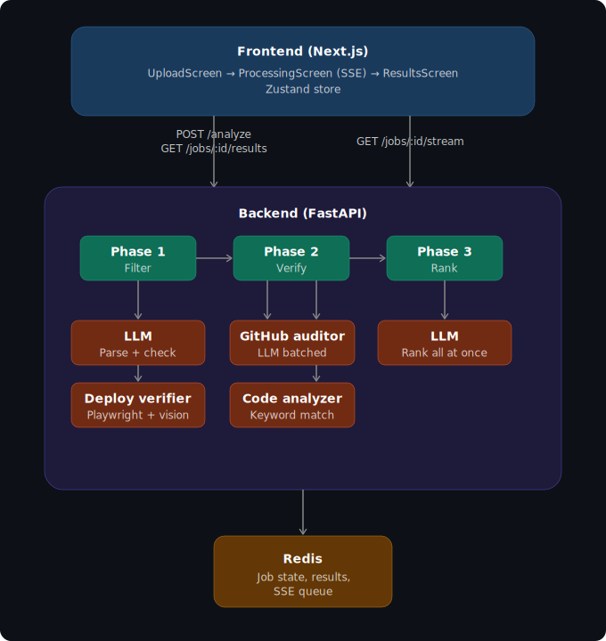

<h1 align="center">Shortlyst</h1>

<p align="center">
  Multi-agent pipeline that verifies candidate claims against real code, real deployments, and real evidence — then ranks by what it finds.
</p>

<p align="center">
  
  
  
  
  
</p>

<p align="center">
  <a href="#quickstart">Quickstart</a> · <a href="#architecture">Architecture</a> · <a href="#api">API</a> · <a href="#contributing">Contributing</a>
</p>

---

## Why

Resumes lie. Candidates list skills they barely touched, link repos full of tutorial forks, and claim "deployed" projects that never left localhost. Recruiters can't verify any of it at scale. Shortlyst automates the verification.

## What It Does

| Phase | Method | Detail |
|-------|--------|--------|
| **Filter** | LLM parsing + deterministic checks | Hard-gate on skills, experience, education, GitHub presence. Eliminated candidates get specific reasons. |
| **Verify** | GitHub audit + code analysis + deployment check | Repos assessed via batched LLM. Skills matched via regex against source. URLs screenshotted with Playwright and analyzed by vision AI. |
| **Rank** | Single weighted LLM call | GitHub (50%) · Deployment (30%) · Skills match (20%) |

All phases stream progress via SSE in real time.

## Architecture

<p align="center">
  
</p>

## Tech Stack

| Layer | Choice | Rationale |
|-------|--------|-----------|
| Backend | FastAPI + Uvicorn | Async-native, SSE, Pydantic validation |
| LLM | GPT-4o / Claude (configurable) | OpenAI for vision, either for text |
| Resume parsing | pdfplumber | Text + annotation extraction |
| Browser | Playwright | Headless Chromium screenshots |
| Cache | Redis | Job state, SSE queue, GitHub cache (1h TTL) |
| HTTP | httpx | Async with retry + rate-limit handling |
| Frontend | Next.js 16, React 19, Zustand | Server components, TypeScript |

## Quickstart

**Prerequisites:** Python 3.12+ · Node.js 18+ · Redis · API keys (`OPENAI_API_KEY`, `ANTHROPIC_API_KEY`, `GITHUB_TOKEN`)

```bash
git clone https://github.com/HimJar911/Shortlyst.git && cd Shortlyst

# backend
cd backend
python -m venv venv && source venv/bin/activate  # Windows: .\venv\Scripts\Activate.ps1
pip install -r requirements.txt
python -m playwright install chromium

# frontend
cd ../frontend && npm install
```

Copy `.env.example` → `backend/.env`:

```env
ANTHROPIC_API_KEY=sk-ant-...
OPENAI_API_KEY=sk-...
GITHUB_TOKEN=ghp_...
REDIS_URL=redis://localhost:6379/0
LLM_PROVIDER=openai          # openai | anthropic
LLM_MODEL=gpt-4o
LLM_MODEL_MINI=gpt-4o-mini
LLM_MAX_CONCURRENT=3
```

```bash
redis-server                                    # T1
cd backend && uvicorn main:app --reload         # T2
cd frontend && npm run dev                      # T3
```

→ [localhost:3000](http://localhost:3000)

**Docker:** `docker-compose up --build`

## Usage

1. Paste or upload a job description.
2. Drop resume PDFs (batch supported).
3. Toggle **Require GitHub** if needed.
4. Click **Analyze Candidates** — watch real-time progress.
5. View ranked results with scores, evidence, and elimination reasons.

## API

### `POST /analyze`

`multipart/form-data`

| Field | Type | Required | Notes |
|-------|------|:--------:|-------|
| `jd_text` | string | * | *One of `jd_text` / `jd_file` required |
| `jd_file` | file | * | Job description PDF |
| `resumes` | file[] | ✓ | Max 1000, 10MB each |
| `require_github` | bool | | Default `false` |

```json
→ { "job_id": "abc-123", "status": "queued", "total_resumes": 5 }
```

### `GET /jobs/{job_id}/stream`

SSE. Events: `phase_start` · `jd_parsed` · `candidate_passed_phase1` · `candidate_eliminated` · `phase2_candidate_start` · `phase2_candidate_complete` · `phase_complete` · `complete` · `error`

### `GET /jobs/{job_id}/results`

Ranked + eliminated candidates with scores and reasoning. `202` if processing, `404` if not found.

### `GET /health`

`→ { "status": "ok" }`

## Project Structure

```
backend/
├── main.py                    # Entrypoint, lifespan, CORS
├── config.py                  # Pydantic Settings
├── agents/
│   ├── phase1_filter.py       # JD parsing + hard filters
│   ├── github_auditor.py      # Batched repo assessment
│   ├── code_analyzer.py       # Regex skill verification
│   ├── ranking_agent.py       # Final ranking
│   └── deployment_verifier.py # Screenshot + vision
├── pipeline/
│   ├── orchestrator.py        # Phase coordinator
│   ├── phase1.py → phase3.py  # Screening → verification → ranking
├── services/
│   ├── claude_client.py       # LLM abstraction (OpenAI/Anthropic)
│   ├── redis_queue.py         # Job state + SSE
│   ├── github_client.py       # GitHub API
│   ├── pdf_parser.py          # PDF extraction
│   ├── playwright_service.py  # Browser pool
│   └── vision_service.py      # Vision analysis
└── models/                    # Pydantic models

frontend/src/
├── components/                # Upload, processing, results views
├── store/jobStore.ts          # Zustand state
├── lib/api.ts                 # API client + SSE
└── types/index.ts
```

## Design Decisions

| Decision | Rationale |
|----------|-----------|
| Deterministic skill verification | Regex against source code. No LLM. Reproducible, fast, auditable. Case-sensitive for short names (Go, R, C). |
| Single-call batching | One LLM call for all repos, one for all candidates. Cuts latency and cost vs per-item. |
| Deployment screenshot + vision | Headless Chromium screenshots → vision AI distinguishes real apps from templates. |
| Soft commit signals | Commit frequency informs but never penalizes. Sparse history ≠ bad engineer. |
| Concurrency semaphore | `LLM_MAX_CONCURRENT` prevents TPM spikes. Exponential backoff + jitter on 429s. |
| GitHub caching | Redis, 1h TTL. Same candidate across runs = one API call. |

## Contributing

1. Fork → feature branch → PR against `main`
2. Backend: `pytest`. LLM calls go through `claude_client` abstraction.
3. Frontend: `npm run build` must pass clean.
4. SSE changes: update both `backend/models/result.py` and `frontend/src/lib/api.ts`.

## License

Proprietary. All rights reserved.